# Smart Home App

A Kotlin-based mobile application for controlling and monitoring smart home devices. This app provides an intuitive interface for managing lights,
temperature, security, and other IoT-enabled features, designed for seamless integration with HomeControl Box system.

## Features

- 🔌 Control devices (lights, outlets, fans, thermostats, cameras, etc.)
- 📡 Real-time monitoring sensors, camera, power usage
- 🧠 Routines automation (e.g., "Adaptive ligh", "Automatically lock doors", "Turn on AC if temperature > a value, etc.)
- 🕒 Scheduler and timer-based automation
- 🔔 Push notifications for events (door open, smoke detected, water leak)
- 👤 User authentication and access control

## Tech Stack

- **Language:** Kotlin
- **Architecture:** MVVM (Model-View-ViewModel)
- **UI:** Xml
- **Networking:**  WebSockets
- **Data Persistence:** Room / Firestore
- **Authentication:** Firebase Auth

## 🛠️ Setup Instructions

1. Clone the repository:

    - Open the project in Android Studio.

2. Set up Firebase:

    - Go to Firebase Console and create a new project.

    - Add a new Android app in your Firebase project settings.

    - Download the google-services.json file.

    - Place the google-services.json file in your app module’s app/ directory.

3. Update Firebase references in code:

    - Open the project and replace any placeholder Firebase URLs or keys with your own.

    - Look for the Firebase database URL or Firestore references and update them to match your project (FirebaseService.kt, and other files).

## Images of the app:

  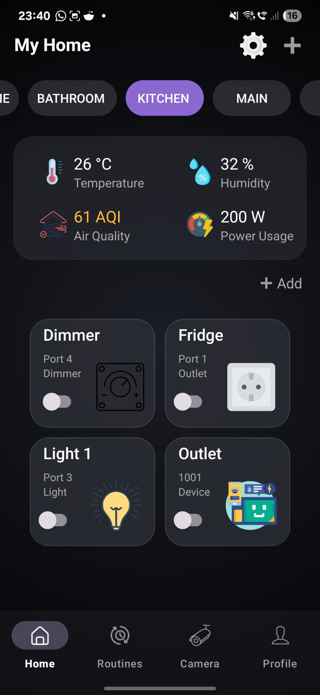
  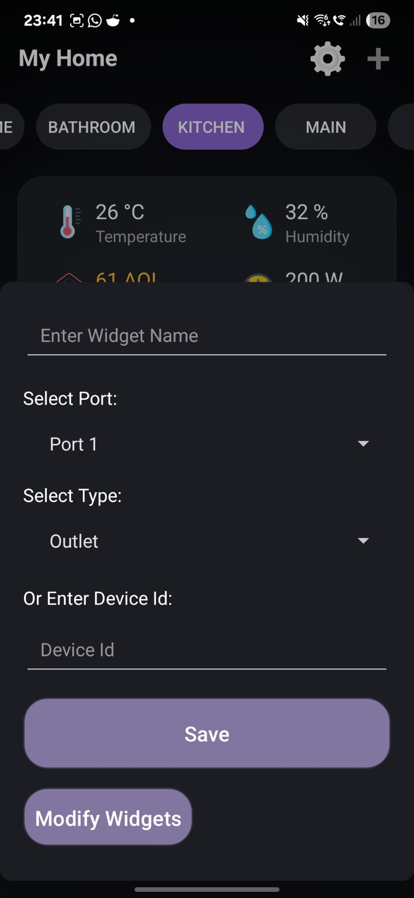
  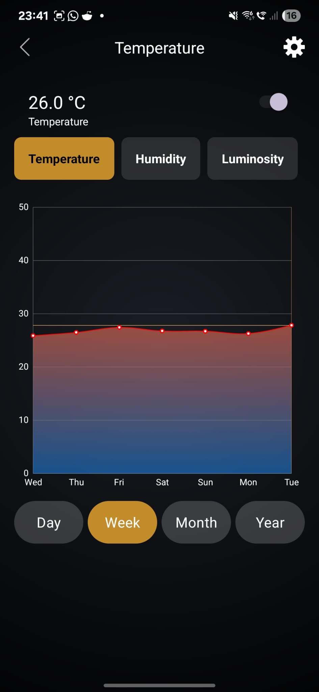

  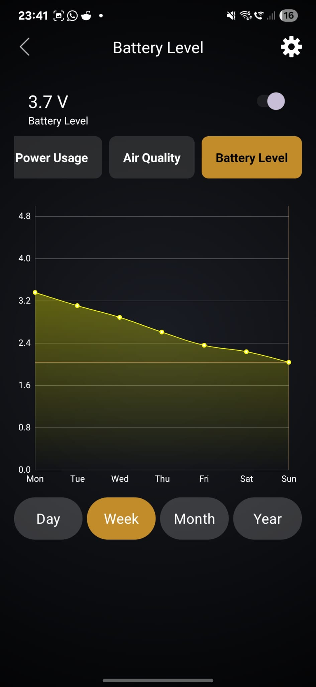
  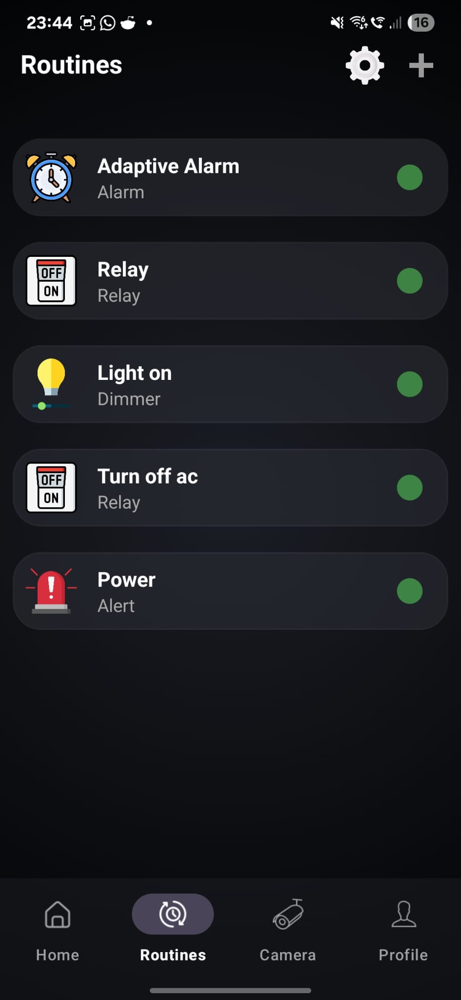
  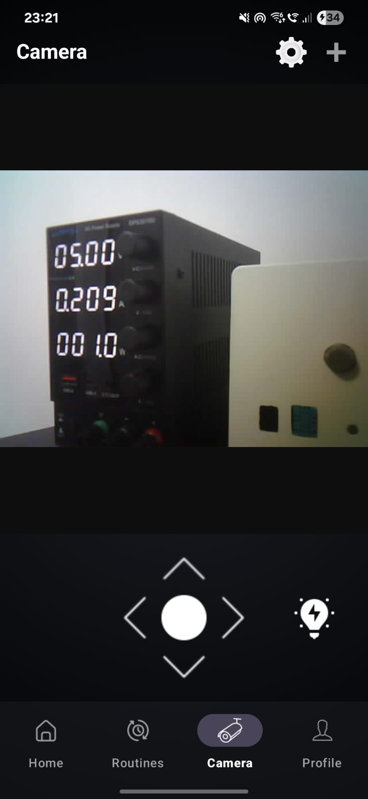

  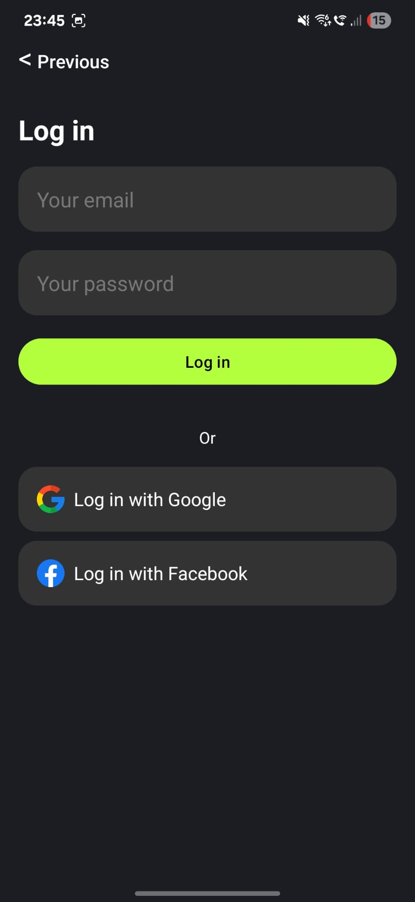
  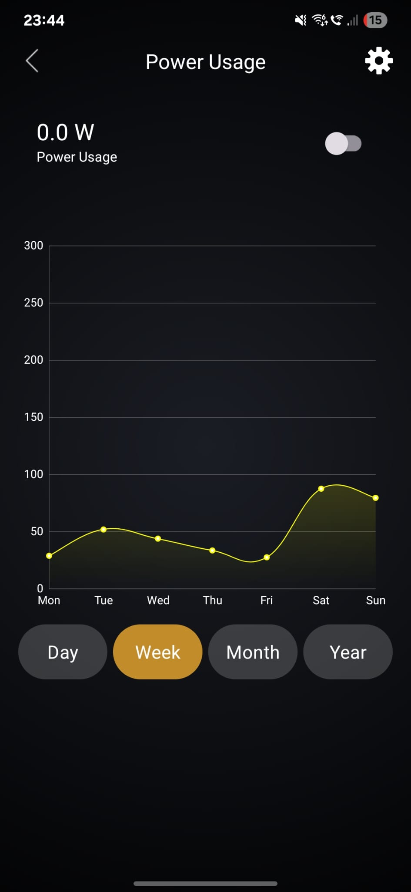
  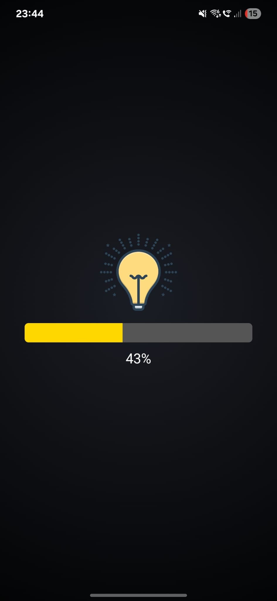

  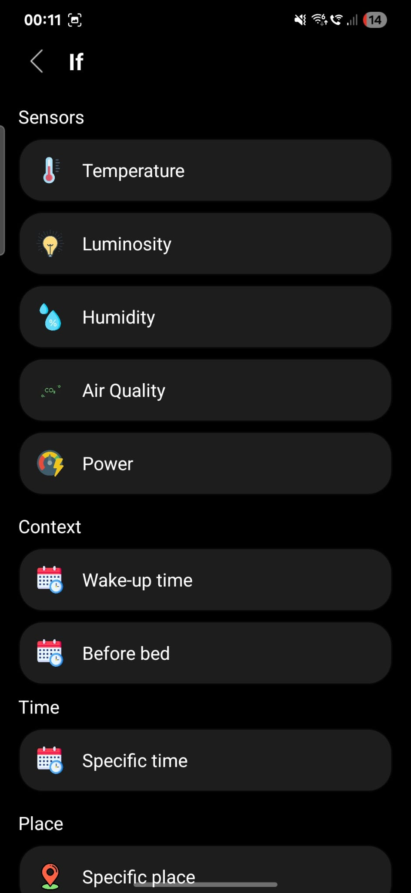
  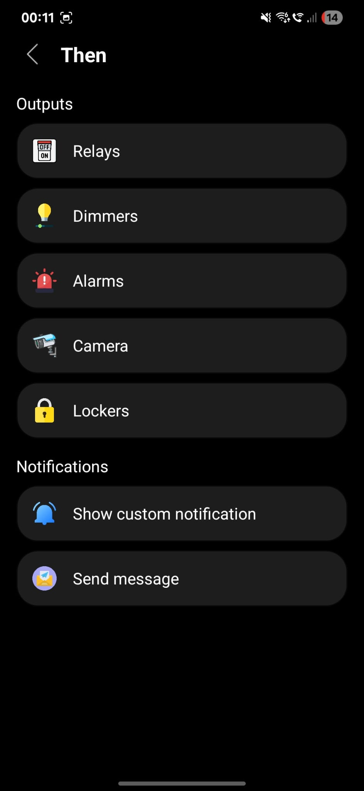
  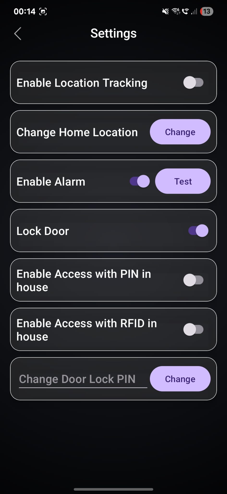

